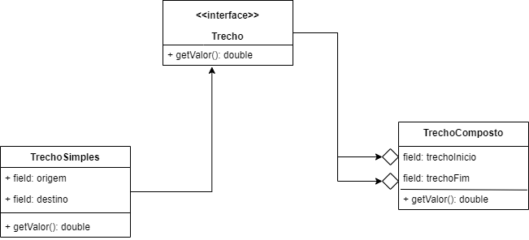

# About project

Project created after learning the composite pattern. Written in Java.

# Pattern Composite - Structural Pattern
  From Wikipedia, the free encyclopedia

In software engineering, the composite pattern is a partitioning design pattern.
The composite pattern describes a group of objects that are treated the same way as a single instance of the same type of object.
The intent of a composite is to "compose" objects into tree structures to represent part-whole hierarchies.
Implementing the composite pattern lets clients treat individual objects and compositions uniformly.

The Composite design pattern is one of the twenty-three well-known GoF design patterns that describe how to solve recurring design problems to 
design flexible and reusable object-oriented software, that is, objects that are easier to implement, change, test, and reuse.

## Problem

An airline needs to solve a problem: A ticket can be made up of a single leg or a composite leg. We need to calculate the value.

